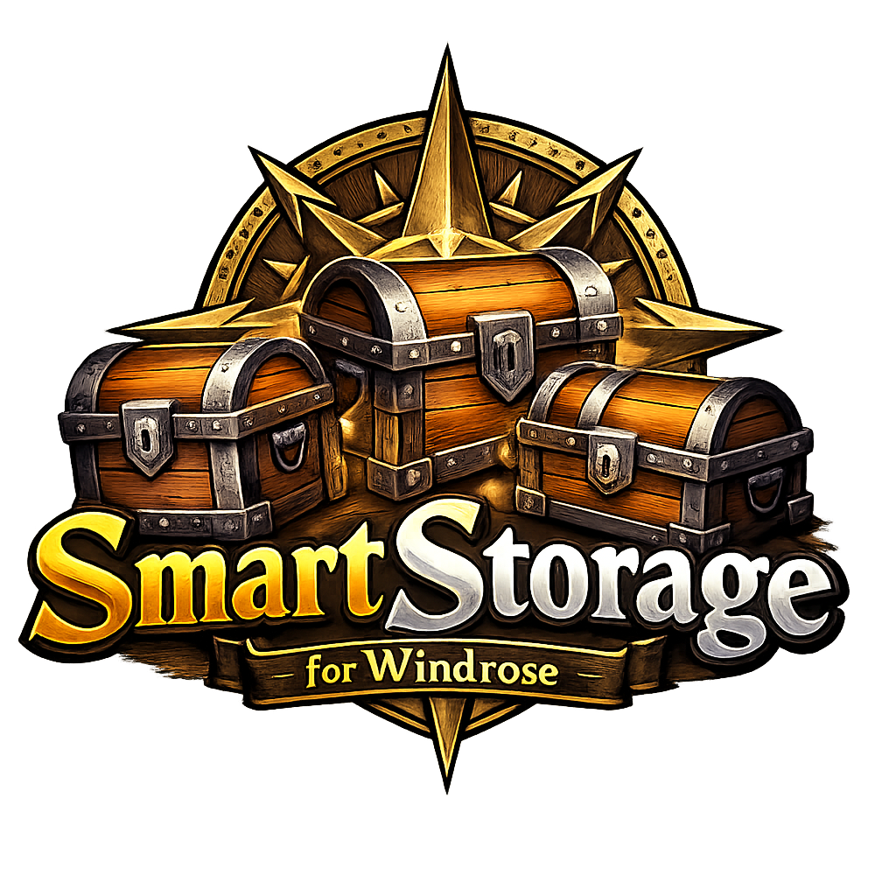
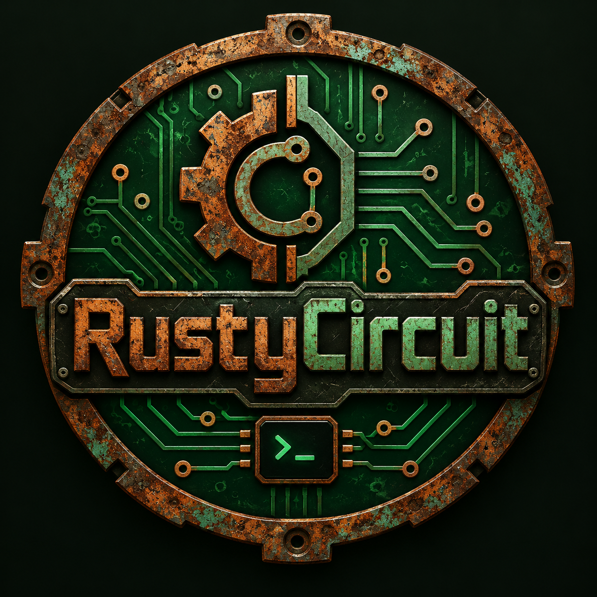

<div align="center">



# SmartStorage

### Smarter Quick Deposit for **Windrose**

[](https://github.com/UE4SS-RE/RE-UE4SS)


**Deposit similar items across the storage chests in your camp with one action.**  
Keep specific chests out of SmartStorage when you want to preserve manual control.

</div>

---

## What is SmartStorage?

SmartStorage is a **UE4SS Lua mod for Windrose** that extends the game's existing **Deposit Similar** interaction.

Instead of depositing only into the chest you are currently looking at, SmartStorage can reuse Windrose's normal deposit behavior across the other eligible storage chests in the **same camp**.

The goal is simple: spend less time opening storage boxes and more time playing.

### Highlights

- **Deposit to all** eligible storage chests in the same camp.
- Two interaction styles: **Keybind** and **Expand**.
- **Exclude / Include** individual chests at any time.
- Exclusions are **saved per world**.
- Multiplayer-aware synchronization for individual players.
- Reuses Windrose's own **Deposit Similar** behavior instead of implementing a separate inventory-transfer system.
- Configurable keybinds and logging.
- Tested in **Singleplayer, Listen Host and Dedicated Server** environments.

---

## How it works

SmartStorage has two modes.

### Keybind mode

Look at a storage chest and press the configured **Deposit to all** key.

With the default configuration:

| Key | Action |
| --- | --- |
| `F5` | Deposit similar items across eligible storages |
| `F6` | Exclude / include the chest you are looking at |

The chest you are looking at acts as the origin. Windrose performs its normal Deposit Similar action, and SmartStorage extends that action to the other eligible chests in the same camp.

### Expand mode

Expand mode integrates SmartStorage directly into Windrose's normal **Deposit Similar** interaction.

| Key | Action |
| --- | --- |
| `Q` | Vanilla Deposit Similar, expanded across eligible storages |
| `F6` | Exclude / include the chest you are looking at |

This mode keeps the normal Windrose interaction while expanding its reach to the rest of your camp storage.

---

## Excluding storage chests

Not every chest should necessarily participate in automatic deposits.

Look at a chest and press the configured **Exclusion** key (`F6` by default) to toggle it:

- **Exclude from SmartStorage** — the chest will be skipped.
- **Include in SmartStorage** — the chest becomes eligible again.

The interaction UI shows the current action while looking at a storage chest.

Exclusions are persisted **per world** and synchronized with the authoritative game/server process for the player using SmartStorage.

---

## Installation

### Requirements

- **Windrose**
- **UE4SS** installed and working

### Client / Singleplayer

Copy the complete `SmartStorage` folder into your UE4SS mods directory:

```text
Windrose/
└── R5/
    └── Binaries/
        └── Win64/
            └── ue4ss/
                └── Mods/
                    └── SmartStorage/
```

The important part is that the final path contains:

```text
ue4ss/Mods/SmartStorage/Scripts/main.lua
```

### Host / Listen Server

When hosting a multiplayer game from the normal Windrose installation, SmartStorage must also be installed in the host server build:

```text
Windrose/
└── R5/
    └── Builds/
        └── WindowsServer/
            └── R5/
                └── Binaries/
                    └── Win64/
                        └── ue4ss/
                            └── Mods/
                                └── SmartStorage/
```

### Dedicated Server

The standalone dedicated server uses its own **Windrose Dedicated Server** installation rather than the normal `Windrose` folder:

```text
Windrose Dedicated Server/
└── R5/
    └── Binaries/
        └── Win64/
            └── ue4ss/
                └── Mods/
                    └── SmartStorage/
```

For multiplayer use, SmartStorage should be installed on the **host/dedicated server** and on each **client that will use the mod**.

---

## Configuration

SmartStorage reads its settings from `config.ini`.

A typical configuration looks like this:

```ini
[General]
ModMode=Keybind

[Keybinds]
DepositAllKey=F5
ExclusionKey=F6

[Logging]
LoggingMode=Default
```

### Available settings

| Setting | Values | Default | Description |
| --- | --- | --- | --- |
| `ModMode` | `Keybind`, `Expand` | `Keybind` | Selects how SmartStorage activates Deposit to all |
| `DepositAllKey` | Valid UE4SS key name | `F5` | Deposit-to-all key in Keybind mode |
| `ExclusionKey` | Valid UE4SS key name | `F6` | Toggles the selected chest in/out of SmartStorage |
| `LoggingMode` | `Default`, `Debug` | `Default` | Enables additional diagnostic logging |

Configuration values are case-insensitive.

---

## Multiplayer support

SmartStorage has been tested with:

- **Singleplayer**
- **Listen host / hosted multiplayer**
- **Dedicated server multiplayer**

SmartStorage keeps deposit origin, mode and exclusion information synchronized with the authoritative server so remote clients can use the same behavior as a local player.

Each player's exclusion state is handled independently on the server.

---

## Which chests are targeted?

SmartStorage only expands the deposit to storage chests that are:

1. Valid and currently available to the game.
2. Different from the origin chest.
3. Part of the **same camp/building storage graph** as the origin chest.
4. Not excluded by the current player.

This prevents a Deposit to all action from blindly targeting unrelated storage elsewhere in the world.

---

## Save data

Persistent exclusions are stored under:

```text
SmartStorage/Data/exclusions/
```

Each world gets its own JSON file based on the world's ID.

You normally do not need to edit these files manually.

---

## Troubleshooting

### F5 / F6 does nothing

Check that:

- UE4SS loaded SmartStorage successfully.
- The configured key name is valid.
- You are looking directly at a supported storage chest.
- Another mod or keybind is not consuming the same key.

### Deposit to all finds no targets

The other chests must belong to the **same camp** as the chest you are using, and they must not be excluded.

### Something broke after a Windrose update

SmartStorage integrates with internal Windrose interaction and Gameplay Ability systems. A game update can therefore change something the mod relies on.

Set:

```ini
[Logging]
LoggingMode=Debug
```

and check the UE4SS log for lines beginning with:

```text
[SmartStorage]
```

When reporting a bug, include whether it happened in **Singleplayer, Host or Dedicated** mode and attach the relevant log section.

---

## Technical notes

<details>
<summary>For developers / curious users</summary>

SmartStorage deliberately reuses Windrose's vanilla **Deposit Similar** pipeline.

At a high level:

```text
Player activates Deposit Similar
        ↓
Windrose builds its normal target data
        ↓
SmartStorage captures the relevant Gameplay Ability target-data call
        ↓
Eligible storage targets are selected
        ↓
The vanilla deposit call is replayed for those targets
```

This means SmartStorage does **not** implement its own item-stack transfer rules. Windrose remains responsible for deciding what counts as a similar/depositable item.

The mod includes safeguards around the temporary interaction-owner swap used during replay, including verification and restoration before continuing to another target.

</details>

---

## Project structure

```text
SmartStorage/
├── config.ini
├── Scripts/
│   ├── main.lua
│   ├── chest.lua
│   ├── quick_deposit.lua
│   ├── excluded.lua
│   ├── persistence.lua
│   ├── logger.lua
│   └── dkjson.lua
│
└── Data/
    └── exclusions/
        └── <worldId>.json
```

---

## Development status

SmartStorage is still a **pre-1.0** project, but its current core feature set has been tested across Singleplayer, Host and Dedicated Server setups.

The project is intentionally developed in small, testable steps with known-good Git checkpoints kept along the way.

---

## Disclaimer

SmartStorage is an unofficial community mod and is not affiliated with or endorsed by the developers or publishers of Windrose.

Game names, logos and trademarks belong to their respective owners.

---

<div align="center">

### Created by RustyCircuit



*Built because opening the same pile of storage chests gets old surprisingly fast.*

</div>
